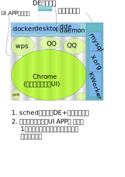

# 集成状态(DDE)
- https://cr.deepin.io/#/c/28400/
- https://cr.deepin.io/#/c/28389/
- https://cr.deepin.io/#/c/28490/
- https://cr.deepin.io/#/c/28516/
- https://cr.deepin.io/#/c/28389/

# 问题描述
当UI App + DE 组件已经超过物理内存大小，开始频繁使用swap时，在kernel角度来看，UI App与非UI App的优先级是一致的，因此会尽量满足所有进程的资源需求，导致频繁的将UI App的page向swap写入/读取。

正常kernel process sched会从大局考虑，尽可能的优先让所有任务都尽快结束。而DE角度更多
的是保证UI App以及DE组件能快速响应，至于任务总体完成时间变慢是可以接受的。

# 术语
- UI App : 由launcher, dock等用户通过DE组件启动的应用程序，如chrome, wps, 文件管理器等。 属于用户直接使用的应用，大部分CPU时间处于等待用户交互。
- DE组件: 如launcher, dock, 控制中心, 桌面，以及非UI类的pulseaudio, networkmanager等
- 系统组件:  Xorg, dbus-daemon, 窗管, 等时时刻刻都需要被激活的程序
- 物理内存:  实际的RMA内存
- swap内存: 由硬盘提供的虚拟内存
- 系统内存: 物理内存+swap内存 

# 测试方式
1. 注销登录，启动terminal或通过其他机器ssh上来(若ssh则需要执行export DISPLAY=:0)
2. 执行./sched -daemon 启动调度进程。(按照提示执行一些必要的系统环境准备)
3. 多次通过 ./sched /opt/deepinwine/apps/Deepin-QQ/run.sh  这种方式启动所需的UI应用。(或者使用./batch_test.sh 执行预先设置的几个应用)
    对比测试时不要混合测试。即不要使用launcher/docker等方式混合./sched cmd 这种形式，避免干扰。
    
## 已知问题
1. [ ] ssh由于dbus session的问题，暂时无法执行
2. [x] memory lock可能失败。 需要使用./sched -daemon -lock=false执行
3. [x] QQ的启动脚本会传递请求给其他后台进程，导致脱离了独立的cgroup 内存只由uiapps这个大组限制。可能会造成卡其他UI App的情况。
4. [x] _NET_ACTIVE_WINDOW间隔性获取失败

# 解决思路
## 内存不足时，回收(memory reclaim)不必要的组件
- dde-osd
- dde-launcher

类似kernel VM对待文件系统cache(预读)内存一样。
在内存足够时，使用高速内存来换取潜在的响应速度大幅度提升。
在内存不足时，自动回收这些奢侈消费。
DE提供一个系统状态的属性，各DE组件监听此状态，并做合理的响应
低内存，内存不足(已经开始严重影响系统性能)
移动网络状态
低电量状态

## 内存不足时，限制UI App的内存使用

内存不足是表面现象，核心问题在于资源竞争，导致90%的时间浪费，整个系统
响应时间严重下降。

而内存不足在操作系统角度是无法解决的，因此要打破资源竞争只能通过高维度下的调度干扰来指挥各进程的资源使用。
而
DE组件,核心组件等是保证“响应速度"的前提，且占用资源比例较小且在可知的范围内。
UI App的数量以及资源使用情况是不确定的，实际造成内存不足是由UI App引起的。
在内存不足时，让DE对UI App进行调度，同一时刻只允许一个UI App进程组运行，以便减少
资源竞争的发生。

# 实现方式

1. 所有的UI APP通过sched进行启动。
2. sched将所有UI APP都放入memory:$session\_id@UIApps这个group中
3. sched在memory:id@UIApps下给每个UI APP建立一个唯一的group: memory:$session\_id@UIApps/$app\_id
4. 计算memory:$session\_id@UIApps实际使用的内存大小M(UI)
5. 获取当前可用剩余内存M(rem) 
6. 设置memory:$session\_id@UIApps的soft\_memory\_limit为 M(UI) + M(rem)
7. 根据\_NET\_ACTIVE\_WINDOW_以及cgroup的一些特性，算出是否存在有被管理的app....
8. 在M(UI)+M(rem)的大前提下，根据app所需的内存动态调整limit ....
