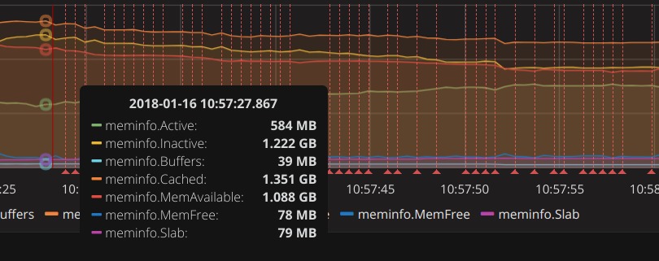

# 服务器部署 (自己服务器或笔记本上操作)
1. docker-compose up
2. 打开127.0.0.1:3000
3. 进入DataSources, 修改数据库名为test, 账号密码为snyh. (具体参考docker-compose.yml的内容)
4. 进入Dashboards,选择import, 选择baord.json导入
5. 调整需要观察的实际数据

# 数据收集 (测试机上操作)
1. 编译inspector，在测试机上执行 ./inspector -addr http://$服务器地址:8086
2. 模拟实际使用场景

# 默认配置
1. Active, Inactive, Cache, Buffers. (具体使用时，需要自行组合参数减少干扰)
2. Hotspot 为CUP IOWait使用率大于80%的区域. 图中竖线区域

